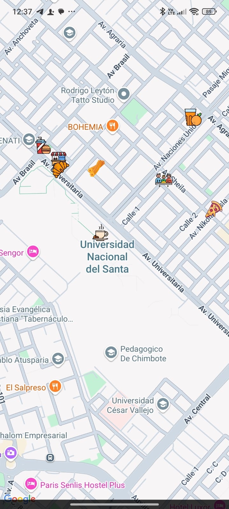
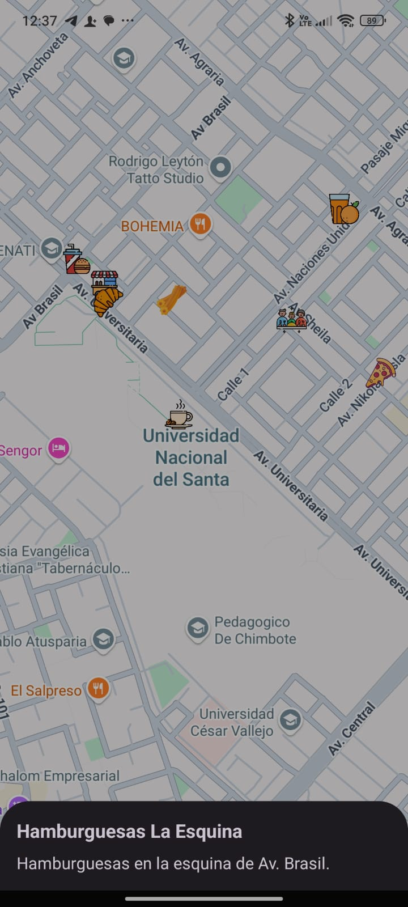
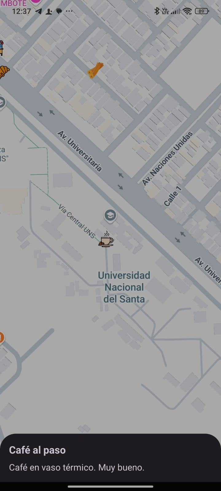
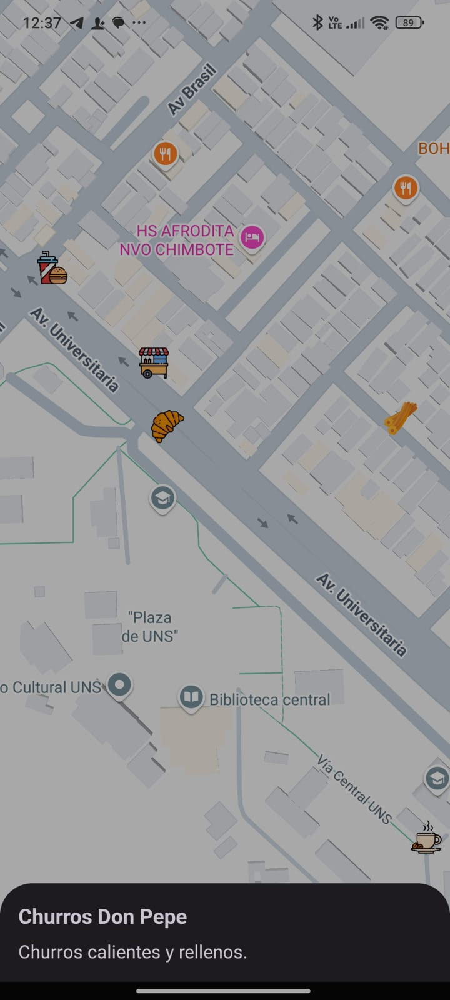

# 🗺️ S13_Briceno_CuchareableAppGoogleMaps – App Móvil con Google Maps y Spots de Comida

`S13_Briceno_CuchareableAppGoogleMaps` es una aplicación Android desarrollada en Kotlin que integra Google Maps para mostrar **puntos de comida cercanos a la Universidad Nacional del Santa (UNS)**. Los usuarios pueden visualizar diferentes tipos de puestos “cuchareables” ubicados alrededor del campus, como venta de churros, jugos, pan con palta, salchipapas y más.

Este proyecto forma parte de la **Semana 13** del curso de Aplicaciones Móviles y tiene como objetivo principal practicar el uso de Google Maps y manejo de datos geográficos.

---

## 📍 Características principales

- Mapa centrado en la zona de la UNS.
- Marcadores con íconos personalizados por tipo de comida.
- Descripciones breves de cada puesto.
- Organización modular del código siguiendo buenas prácticas.
- Implementación de ViewModel para separación de responsabilidades.

---

## 🍟 Lugares incluidos

Algunos de los spots "cuchareables" cercanos que se muestran son:

- **Churros Don Pepe** – Churros calientes y rellenos.
- **Hamburguesas Leo** – Hamburguesas artesanales.
- **Chocho Express** – Refresco de chocho al instante.
- **Antojitos Mary** – Salchipapas y snacks.
- **Pan con palta La Uni** – Pan con palta y café económico.
- **Café al paso** – Café en vaso térmico.
- **MiniPizza Express** – Mini pizzas a la leña.
- **Jugos Naturales Anita** – Jugos y sánguches frescos.

---

## 📸 Capturas de pantalla

| 🟢 Pantalla de inicio | 🍟 Mapa con spots cercanos | 🍔 Vista de otros puntos | 🍩 Zona ampliada con íconos |
|------------------------|-----------------------------|--------------------------|-----------------------------|
|  |  |  |  |

---

## 🛠️ Tecnologías utilizadas

- Kotlin
- Android Studio
- Google Maps SDK
- ViewModel
- Archivos `.xml` y `Drawable` para íconos personalizados

---

## 📁 Estructura del proyecto

- `MainActivity.kt`: Pantalla principal que carga el mapa y los marcadores.
- `ComidaSpot.kt`: Clase de datos para representar cada puesto de comida.
- `MapViewModel.kt`: Lógica que organiza y entrega la lista de lugares a mostrar.
- `obtenerIconoPorTipo()`: Método para retornar íconos personalizados según tipo.
- `AndroidManifest.xml`: Contiene la declaración del API Key de Google Maps.

---

## 🔐 Protección del API Key

El `API_KEY` de Google Maps está almacenado en un archivo `local.properties`, el cual no se sube al repositorio gracias a la inclusión en `.gitignore`. El archivo `AndroidManifest.xml` accede a la clave usando una referencia:

```xml
<meta-data
    android:name="com.google.android.geo.API_KEY"
    android:value="${MAPS_API_KEY}" />
